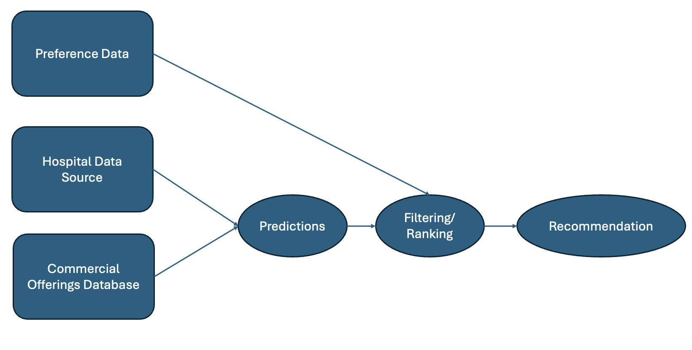

# MSDS_490
Recommender Systems

# Assignment 4
Please go to the assignment_4 folder and then find the relevant code and readme for assignment 4. 

# Assignment 3
Please go to the assignment_3 folder and then find the relevant code and readme for assignment 3. 

# Assignment 2
Please go to the assignment_2 folder and then find the relevant code and readme for assignment 2. 

# Assignment 1
Whether in your previous or current employment (or even with a future employer), answer the following questions:

#### 1. How would you deploy a recommender system to serve your employees or customers? ####

In my previous employment as a student researcher in radiation oncology, I would use recommender systems to help patients find resources in relation to their treatment. The radiation oncology department works with cancer patients. This system would be multifaceted and could recommend restaurants, hotels, and any tangible items like ice caps relative to the patients' treatment and location. This would make the patient and caregiver experience better, and create a better environment for cancer treatments. The recommendation would be based on different parts of the treatment that could be personalized to the patient. How long is the treatment, is it 100% in hospital or is it in and out. What are the side effects? What products generally help with those side effects? 

#### 2. What problem would you solve using this recommender system to increase employee productivity, improve retention (customer and/or employee), increase revenue, or increase profits? #### 

This would improve patient retention and could contribute to a higher hospital rating. This could potentially be offered by a third party or the hospital to bridge the gap between a hospital and nearby commercial areas for patients. Businesses could pay to be in the system or there could be some type of revenue sharing set up such that if a patient or caregiver used the site and purchased food/stayed a hotel/bought a product the hospital/business makes money.

#### 3. How would you collect the underlying data needed to make recommendations? ####

This would be a tricky part of this type of product. While the data is already collected for medical purposes, HIPPA requires different levels of data protection. The location data would come from the hospital or location of treatment, and the patient data would include age and gender of patient and type of treatment. The base level of the system would be patient data but more optional fields could include age and gender of the caregiver, interests, likes/dislikes, and more. While this would make the results better, it would not be required to make recommendations. The figure below shows how different data sources and databases would be used to produce a recommendation.

*Figure 1. Flow of data in the system*  

#### 4. What type of data pipeline would you need to ensure your recommendations stay current? #### 

There would have to be a continuous update possible in case the patient treatment changes. The system could be based on changes in the patient treatment plan. These could trigger a refresh. Additionally, new data would be piped in as new restaurants/hotels are added to the system. The pipeline would connect the hospital database to the system. Additionally, there would be a pipeline from commercial offerings changes (ie addition or deletion of resources, restaurants, hotels) to the database of offerings. 

#### 5. How would you deal with data from new employees and/or new customers? ####

As mentioned before, the base level of required data for the system would be tied to the treatment plan of a patient. Thus, this problem would be addressed fairly well. To give more context to this data, a questionnaire could be added when a patient first begins treatment to gather the optional data. 
